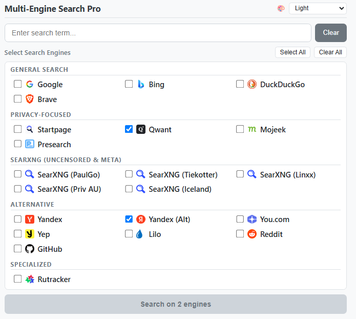

# Usage Guide

This guide provides detailed instructions on how to use Multi-Engine Search Pro effectively.

## 📸 Extension Interface

*The extension popup with search input, organized engine categories, and action buttons*

The extension popup provides a clean, organized interface with the following sections:

## 🔍 Search Input Section

### Search Term Field
- **Purpose**: Enter your search query here
- **Features**: 
  - Auto-saves your search term during the session
  - Restores last search when you reopen the extension
  - Supports any text, including special characters and international text
- **Shortcuts**: Press `Enter` to execute search, `Escape` to clear

### Clear Button
- **Purpose**: Quickly clear the search input field
- **Usage**: Click to clear text and focus back on input field

## ⌨️ Omnibox Search (`ms <query>`)

Execute multi-engine searches directly from Chrome's URL bar without opening the popup:
1. Focus Chrome's address bar (`Ctrl+L` or `Cmd+L`).
2. Type **`ms`** and press **`Space`** or **`Tab`**.
3. Type your search query and press **`Enter`**.
4. Results open across all your active engines simultaneously and will be grouped if tab grouping is enabled.

## 🗂️ Automatic Tab Grouping

Multi-Engine Search Pro can automatically group all opened search result tabs into a native Chrome Tab Group:
- **Group Label & Color**: The group is created with a blue label matching your query (e.g. `🔍 machine learning`).
- **Enabling / Disabling**: Use the `Group Tabs` checkbox in the top-right header next to the theme selector:
  - **Checked (Default)**: All tabs opened by your search are neatly grouped together.
  - **Unchecked**: Tabs open as individual, ungrouped tabs.
- **Persistence**: Your choice is saved automatically and remembered for both popup searches and right-click context menu searches.

## ⚙️ Engine Selection Controls

### Select All / Clear All Buttons
- **Select All**: Checks all available search engines
- **Clear All**: Unchecks all search engines
- **Keyboard Shortcut**: `Ctrl+A` (or `Cmd+A` on Mac) to select all engines

### Category-Level Controls
- **Category Select All / Clear**: Each category header features dedicated **Select All** and **Clear** buttons to control only that category's engines.
- **Title Click Toggle**: Clicking directly on any category title toggles all engines in that category on or off.

### Engine Categories

The 29 available search engines are organized into 6 categories:

#### 🌐 General Search
- **Google**: World's most popular search engine
- **Bing**: Microsoft's search with AI integration
- **DuckDuckGo**: Privacy-focused search without tracking
- **Brave**: Independent search with privacy by design

#### 🔒 Privacy-Focused
- **Startpage**: Private Google results without tracking
- **Qwant**: European privacy-focused search engine
- **Mojeek**: Independent crawler with no tracking
- **Presearch**: Decentralized search engine
- **Kagi**: Ad-free, 100% private premium search engine

#### 🎓 Academic & Research
- **Google Scholar**: Scholarly articles, theses, citations, and court opinions
- **arXiv**: Open-access scientific preprints (CS, AI, math, physics)
- **Semantic Scholar**: AI-powered scientific paper search with citation graph
- **Sci-Hub**: Direct scholarly literature and paper access
- **LibGen**: Scientific articles, textbooks, and books via Library Genesis

#### 🌐 SearXNG (Uncensored & Meta)
- **SearXNG (PaulGo)**: US flagship node (270+ engines, Torrents, Anna's Archive, Yandex, Wiby)
- **SearXNG (Tiekotter)**: High-speed German node (0.17s response, Alexandria, Wiby, Anna's Archive)
- **SearXNG (Linxx)**: French node (270+ engines, Yandex, Torrents, Nyaa, Wiby)
- **SearXNG (Priv AU)**: Australian node (Oceania routing, bypasses US/EU DMCA delistings)
- **SearXNG (Iceland)**: Iceland node (270+ engines, protected by strict free-speech laws)

#### 🌍 Alternative
- **Yandex**: Leading international search engine
- **Yandex (Alt)**: Lightweight ya.ru portal
- **You.com**: AI-powered personalized search
- **Yep**: Search engine by Ahrefs
- **Lilo**: French eco-friendly search engine
- **Reddit**: Community discussions and forums
- **GitHub**: Code repository and open-source project search

#### 🎯 Specialized
- **Rutracker**: Public forum and media index search
- **Anna's Archive**: Universal shadow library search engine
- **BTDigg**: Decentralized BitTorrent DHT search engine

## 🚀 Search Execution

### Search Button
The search button is dynamic and shows different text based on your selections:

- **No engines selected**: "Select at least one engine" (disabled)
- **One engine selected**: "Search on [Engine Name]"
- **Multiple engines selected**: "Search on X engines"

### Search Process
1. Enter your search term
2. Select one or more search engines
3. Click the search button or press `Enter`
4. New tabs will open with search results from each selected engine
5. The extension popup will close automatically

### 🖱️ Right-Click Context Menu Search
You can search selected text on any webpage without opening the popup:
1. Highlight any word or phrase on any web page
2. Right-click the highlighted text
3. Click **Search with Multi-Engine: "your text"**
4. All your preferred engines (saved in the extension) will open in new tabs!

### 🎨 Theme Switching
Use the theme dropdown in the top-right corner to switch between:
- **Auto (System)**: Follows browser and OS dark/light mode
- **OLED Dark**: Pure `#000000` pitch black for OLED panels
- **Dark**: Balanced dark charcoal mode
- **Light**: Crisp daylight theme
- **Midnight Blue**: Deep naval twilight aesthetic
- **Cyberpunk**: Neon pink & purple high-contrast theme

Your selected theme is saved permanently across sessions.

## 💾 Smart Memory Features

### Session Memory
- **Search Terms**: Your last search term is remembered until you close the browser
- **Automatic Restore**: When you reopen the extension, your last search appears in the input field

### Persistent Preferences
- **Engine Selection**: Your preferred search engines are saved permanently
- **Default Selection**: Google is selected by default for new users
- **Cross-Session**: Your engine preferences persist between browser sessions

## ⌨️ Keyboard Shortcuts

| Shortcut | Action | Context |
|----------|--------|---------|
| `Enter` | Execute search | When search input is focused |
| `Ctrl+A` / `Cmd+A` | Select all engines | Anywhere in popup (except input field) |
| `Escape` | Clear search term | When input has text |
| `Escape` | Close extension | When input is empty |
| `Tab` | Navigate elements | Standard tab navigation |

## 🎯 Usage Patterns

### Quick Single Search
1. Click extension icon
2. Type search term
3. Keep default Google selection
4. Press `Enter`

### Comparison Research
1. Enter your research topic
2. Select 3-4 different engines (e.g., Google, DuckDuckGo, Bing, Yandex)
3. Click search to compare results across engines

### Privacy-Focused Search
1. Clear all selections
2. Select only privacy engines (Startpage, DuckDuckGo, Qwant)
3. Search without tracking

### Specialized Search
1. For forums/trackers: Select Rutracker
2. For international results: Include Yandex, You.com
3. For comprehensive coverage: Select all engines

## 🔧 Status Messages

The extension provides real-time feedback:

### Information Messages
- **"Opening X search tabs..."**: Appears during search execution
- **"Opened X search tabs"**: Success confirmation
- **"Ready to search"**: Default state when everything is set up

### Error Messages
- **"Please enter a search term"**: Shows when trying to search with empty input
- **"Please select at least one search engine"**: Shows when no engines are selected
- **"Error opening search tabs"**: Shows if search execution fails

### Loading States
- Search button shows loading animation during execution
- Button is disabled during search to prevent duplicate requests

## 🛠️ Advanced Tips

### Optimizing Search Performance
- **Selective Engine Use**: Don't always use all engines - select based on your needs
- **Category-Based Selection**: Use "Select All" then uncheck unwanted categories
- **Persistent Setup**: Set up your preferred engines once, they'll be remembered

### Managing Multiple Tabs
- **Background Tabs**: All search results open in background tabs
- **Tab Management**: Use Chrome's tab grouping to organize results
- **Resource Management**: Be mindful of system resources with many engines

### Troubleshooting Common Issues

#### Extension Not Responding
1. Check if popup opens
2. Look for error messages in status area
3. Try refreshing the extension page

#### Search Results Not Opening
1. Verify internet connection
2. Check if popup shows error messages
3. Try with different search engines

#### Search Terms Not Saving
1. Ensure browser allows local storage
2. Check if you're in incognito mode (session storage only)
3. Try refreshing the extension

## 📊 Usage Analytics

The extension tracks (locally only):
- **Last Search Term**: For session convenience
- **Preferred Engines**: For persistent user experience
- **No External Tracking**: All data stays on your device

## 🔒 Privacy Considerations

### Data Handling
- **Local Storage Only**: All preferences stored locally
- **No External Servers**: Extension doesn't communicate with external services
- **Search Privacy**: Your searches go directly to chosen engines

### Engine-Specific Privacy
- **General Engines**: May track searches (Google, Bing)
- **Privacy Engines**: Designed not to track (DuckDuckGo, Startpage)
- **Choose Accordingly**: Select engines based on your privacy preferences

## 🎓 Best Practices

### For Students and Researchers
- Use multiple general engines for comprehensive results
- Include international engines for global perspectives
- Save specialized engines for specific research types

### For Privacy-Conscious Users
- Stick to privacy-focused engines
- Avoid general tracking engines when possible
- Consider using different engines for different search types

### For Power Users
- Set up keyboard shortcuts for fastest access
- Use "Select All" for maximum coverage
- Organize results using browser tab management features

---

Need more help? Check out our [troubleshooting guide](README.md#troubleshooting) or [report an issue](https://github.com/jrcramos/multi_engine_search/issues).